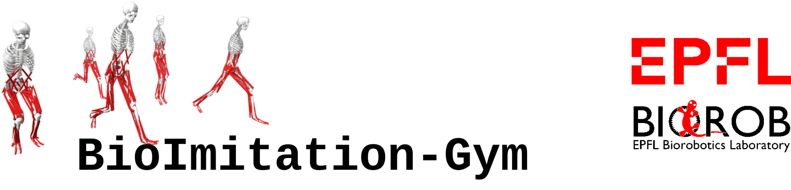
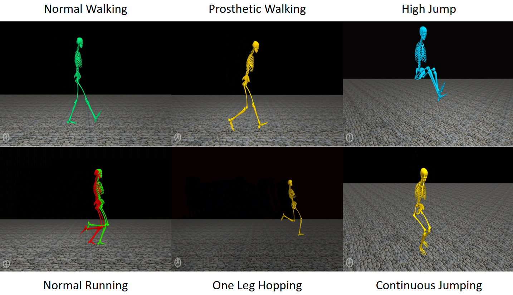
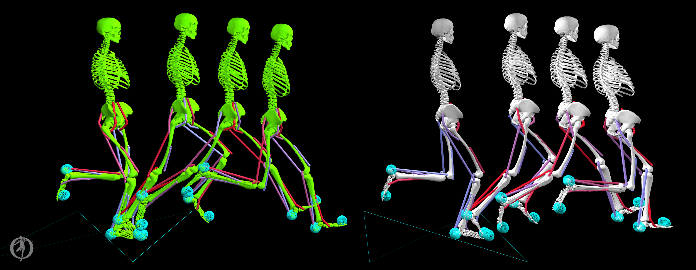

**Authors**: [Utkarsh A. Mishra](https://utkarshmishra04.github.io) and [Dr. Dimitar Stanev](https://www.epfl.ch/labs/biorob/people/stanev/)

**Advisors**: [Dr. Dimitar Stanev](https://www.epfl.ch/labs/biorob/people/stanev/) and [Prof. Auke Ijspeert](https://www.epfl.ch/labs/biorob/people/ijspeert/), Biorobotics Laboratory (BioRob), EPFL

**Video Playlist**: [https://www.youtube.com/playlist?list=PLDvnH871wUkFPOcCKcsTN6ZzzjNZOVlt_](https://www.youtube.com/playlist?list=PLDvnH871wUkFPOcCKcsTN6ZzzjNZOVlt_)

The `bioimiitation-gym` package is a python package that provides a gym environment for training and testing `OpenSim` models. The gym environment is based on the OpenAI gym package.

This work is towards a framework aimed towards learning to imitate human gaits. Humans exhibit movements like walking, running, and jumping in the most efficient manner, which served as the source of motivation for this project. Skeletal and Musculoskeletal human models were considered for motions in the sagittal and frontal plane, and results from both were compared exhaustively. While skeletal models are driven with motor actuation, musculoskeletal models perform through muscle-tendon actuation. 



Model-free reinforcement learning algorithms were used to optimize inverse dynamics control actions to satisfy the objective of imitating a reference motion along with secondary objectives of minimizing effort in terms of power spent by motors and metabolic energy consumed by the muscles. On the one hand, the control actions for the motor actuated model is the target joint angles converted into joint torques through a Proportional-Differential controller. While on the other hand, the control actions for the muscle-tendon actuated model is the muscle excitations converted implicitly to muscle activations and then to muscle forces which apply moments on joints. Muscle-tendon actuated models were found to have superiority over motor actuation as they are inherently smooth due to muscle activation dynamics and don't need any external regularizers.



All the results and analysis are presented in an illustrative, qualitative, and quantitative manner. 

## Installation

Please follow the instructions in the [`installation.md`](https://github.com/UtkarshMishra04/bioimitation-gym/blob/master/installation.md) file to install the package.

## Environment in the `bioimitation-gym` package

All environments in the `bioimitation-gym` package are provided in the `biomitation_envs/imitation_envs/envs` directory.
They are majorly divided into two categories:
- `muscle` environments: These are the environments that are used for training the muscle tendon unit actuated model.
- `torque` environments: These are the environments that are used for training the torque actuate model.

Further, `2D / planar` and `3D / spatial` environments are provided for each category. The tasks covered in each of the sub-categories are as follows:
- Walking
- Running
- Jumping
- Prosthetic Walking with a locked knee joint for the left leg
- Walking with a typical Cerebel Palsy defect

The following 2D muscle actuated environment names can be used based on the package:
- `MuscleWalkingImitation2D-v0`
- `MuscleRunningImitation2D-v0`
- `MuscleJumpingImitation2D-v0`
- `MuscleLockedKneeImitation2D-v0`

The following 3D muscle actuated environment names can be used based on the package:
- `MuscleWalkingImitation3D-v0`
- `MuscleRunningImitation3D-v0`
- `MuscleJumpingImitation3D-v0`
- `MuscleLockedKneeImitation3D-v0`
- `MusclePalsyImitation3D-v0`

The following 2D torque actuated environment names can be used based on the package:
- `TorqueWalkingImitation2D-v0`
- `TorqueRunningImitation2D-v0`
- `TorqueJumpingImitation2D-v0`
- `TorqueLockedKneeImitation2D-v0`

The following 3D torque actuated environment names can be used based on the package:
- `TorqueWalkingImitation3D-v0`
- `TorqueRunningImitation3D-v0`
- `TorqueJumpingImitation3D-v0`
- `TorqueLockedKneeImitation3D-v0`

## Usage Instructions

The complete `bioimitation` directory consists of the following sub-directories:
- `imitation_envs`: This directory contains the data and environments associated with the package.
- `learning_algorithm`: This directory contains the learning algorithm used for several experiments. The code is the modified version of original SAC algorithm and is taken from the open source implementation of `ikostrikov/jaxrl`.

More information on the subdirectories can be found in their respective README files (if any).

The package is mostly based on the highly scalable and distributed reinforcement learning framework Ray RLLIB. The template scipts to train and test the models are provided in the `tests` directory.

To run a RLLIB training script, run the following command:
```bash
python tests/sample_rllib_training.py  --env_name MuscleWalkingImitation2D-v0
```

You can change the algorithm configurations in the `configs` directory. The `configs/train_default.py` file contains the default configuration for the `train` script and the `configs/test_default.py` file contains the default configuration for the `test` script which is:
```bash
python tests/sample_rllib_testing.py
```

The default environment configuration is provided in the `configs/env_default.py` file. Feel free to change the default configuration as per your needs. A typical script to test the environment is provided in the `biomitation_envs/imitation_envs/envs` directory is:
```python
import os
from absl import app, flags
from ml_collections import config_flags
import gym
import bioimitation

FLAGS = flags.FLAGS

flags.DEFINE_string('env_name', 'MuscleWalkingImitation2D-v0', 'Name of the environment.')

config_flags.DEFINE_config_file(
    'config',
    'configs/env_default.py',
    'File path to the environment configuration.',
    lock_config=False)

def main(_):

    example_config = dict(FLAGS.config)

    env = gym.make(FLAGS.env_name, config=example_config)

    env.reset()

    for i in range(1000):
        _, _, done, _ = env.step(env.action_space.sample())
        if done:
            env.reset()

if __name__ == '__main__':
    app.run(main)
```

Don't forget to import the `bioimitation` package before running the script.

## Citation

If you use this work in your research, please cite the following as:
```bibtex
@misc{
    mishra2021bioimitation,
    title = {BioImitation-Gym: A OpenAI-Gym Package for Training and Testing Reinforcement Learning algorithms with OpenSim Models},
    author = {Utkarsh A. Mishra and Dimitar Stanev and Auke Ijspeert},
    year = {2021},
    publisher = {GitHub},
    journal = {GitHub repository},
    url = {https://github.com/UtkarshMishra/bioimitation-gym}
}
```

```bibtex
@article{mishra2021learning,
  title={Learning Control Policies for Imitating Human Gaits},
  author={Utkarsh A. Mishra},
  journal={arXiv preprint arXiv:2106.15273},
  year={2021}
}
```

## References

[1] OsimRL project: [https://osim-rl.kidzinski.com/](https://osim-rl.kidzinski.com/)

[2] OpenSim: [https://github.com/opensim-org/opensim-core](https://github.com/opensim-org/opensim-core) and [https://opensim.stanford.edu/](https://opensim.stanford.edu/)

[3] OpenAI Gym: [https://gym.openai.com/](https://gym.openai.com/)

[4] Ray RLLIB: [https://ray.readthedocs.io/en/latest/](https://ray.readthedocs.io/en/latest/)

[6] ikostrikov/jaxrl: [https://github.com/ikostrikov/jaxrl](https://github.com/ikostrikov/jaxrl)
